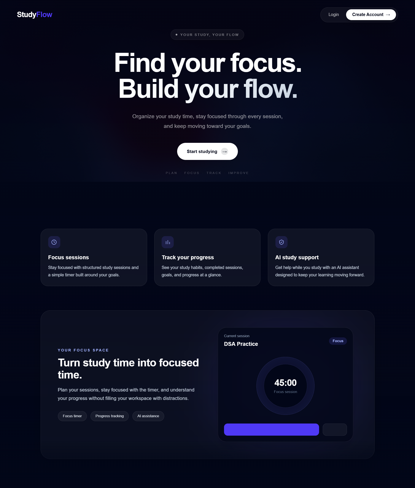
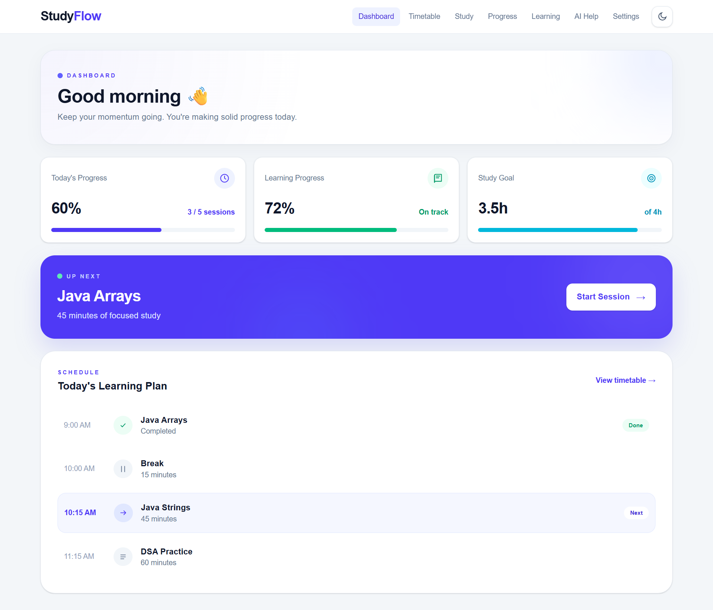
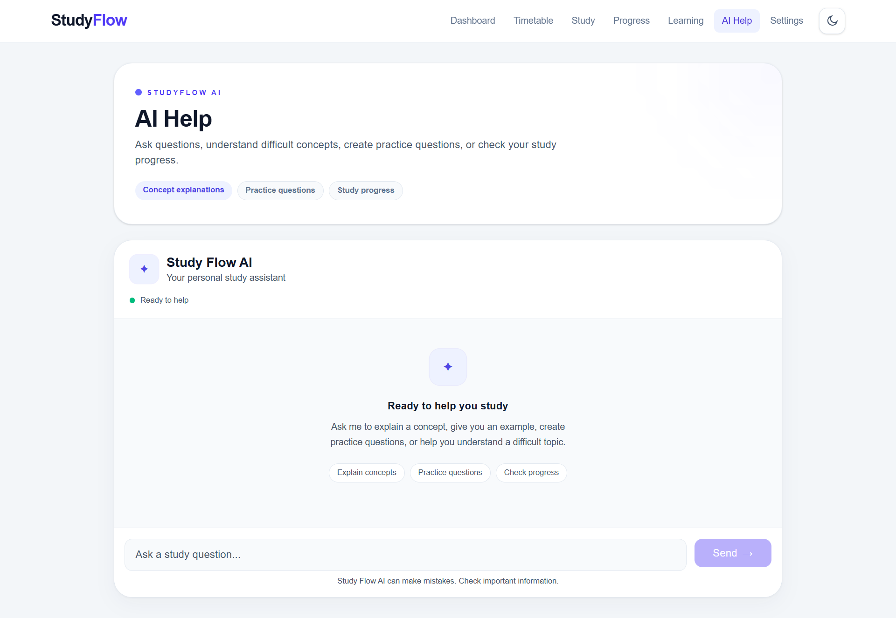

# StudyFlow

StudyFlow is a study planning and productivity app designed to help students plan their study time, stay consistent, track progress, and reflect on their learning.

**Production:** `https://study-flow-nine-pearl.vercel.app/`

---

## Features

* Create and manage study sessions
* Plan a daily study timetable
* Built-in study session timer
* Learning reflection after each session
* Study progress tracking
* AI-powered study assistant
* Server-side AI tool for retrieving study progress
* Structured AI tool results rendered as UI components
* Responsive interface for desktop and mobile
* Health check page
* Interactive 3D focus experience

---

## Screenshots

### Landing Page


### Dashboard




### AI Study Assistant




### 3D Focus Experience


---

## AI Study Assistant

StudyFlow includes an AI study assistant powered by **Google Gemini** through the **Vercel AI SDK**.

The assistant can answer study-related questions and can use a server-side tool when a student asks about their study progress.

The AI API key is kept on the server and is never exposed to the browser.

### `getStudyProgress` Tool

The application exposes a structured server-side tool called `getStudyProgress`.

**Purpose**

Retrieve structured study progress information for a requested subject.

**Input schema**

```ts
{
  subject: string;
}
```

**Example input**

```json
{
  "subject": "Mathematics"
}
```

**Return shape**

```ts
{
  subject: string;
  completed: number;
  total: number;
  percentage: number;
  status: string;
}
```

**Example output**

```json
{
  "subject": "Mathematics",
  "completed": 18,
  "total": 25,
  "percentage": 72,
  "status": "Good progress"
}
```

### Tool Lifecycle UI

The StudyFlow chat handles the different stages of the AI tool lifecycle:

1. **Input streaming** — indicates that the tool request is being prepared.
2. **Input available** — indicates that StudyFlow is processing the requested progress information.
3. **Output available** — renders the structured result as a `StudyProgressCard` instead of exposing raw JSON.
4. **Output error** — displays a dedicated error state if the tool fails.

This demonstrates how structured AI tool output can be integrated directly into application UI rather than simply displaying unformatted model output.

---

## AI API Protection

Because the AI assistant uses a metered external AI API, the production route includes basic protection against trivial abuse.

The AI route implements:

* Maximum **20 messages** per request
* Maximum **4,000 characters** for each user message
* IP-based limit of **10 requests per minute**
* HTTP `429 Too Many Requests` response when the limit is exceeded
* `Retry-After` response header
* A **30-second `maxDuration`** for streaming AI requests

These controls are intended to reduce accidental or trivial API abuse. The in-memory rate limiter is a lightweight protection appropriate for this project; a production system with larger traffic would use a shared/distributed rate-limiting service.

---

## Architecture

StudyFlow follows a Next.js application architecture with a clear separation between the user interface, server-side AI functionality, and supporting tools.

```text
Browser
   │
   ├── Dashboard / Timetable / Timer / Progress
   │
   └── AI Study Assistant
            │
            ▼
       Next.js API Route
            │
            ├── Request validation
            ├── Input limits
            ├── Rate limiting
            └── 30s streaming limit
            │
            ▼
       Vercel AI SDK
            │
            ▼
       Google Gemini
            │
            └── getStudyProgress tool
                       │
                       ▼
                Structured result
                       │
                       ▼
              StudyProgressCard
```

### Main layers

**Frontend**

React components and Next.js pages provide the dashboard, study planning, timer, progress, AI assistant, and 3D experience.

**AI layer**

The server-side AI route uses the Vercel AI SDK to communicate with Google Gemini and stream responses to the client.

**Tool layer**

`getStudyProgress` provides structured study-progress information to the AI model and returns typed data that can be rendered by the UI.

**Validation**

Zod is used where structured validation is required for AI tool inputs.

**Deployment**

The application is deployed using Vercel.

---

## Tech Stack

| Technology        | Purpose                                 |
| ----------------- | --------------------------------------- |
| Next.js           | Application framework and routing       |
| React             | UI components                           |
| TypeScript        | Type-safe application development       |
| Tailwind CSS      | Styling and responsive design           |
| Vercel AI SDK     | Streaming AI responses and tool calling |
| Google Gemini     | AI model                                |
| Zod               | Schema validation                       |
| Three.js          | 3D rendering                            |
| React Three Fiber | React integration for Three.js          |
| Vitest            | Unit/component testing                  |
| Playwright        | End-to-end testing                      |
| Vercel            | Production deployment                   |

---

## Project Structure

```text
app/
├── api/
│   └── chat/
│       └── route.ts
├── (app)/
│   ├── dashboard/
│   ├── ...
│   └── ...
└── 3d/
    └── page.tsx

components/
├── StudyFlowChat.tsx
├── StudyProgressCard.tsx
├── StudyFlow3D.tsx
└── ...

lib/
├── ai.ts
└── tools/
    └── get-study-progress.ts

tests/
├── StudyFlowChat.test.tsx
├── StudyProgressCard.test.tsx
└── e2e/
    └── study-flow.spec.ts
```

---

## Environment Variables

Create a `.env.local` file in the project root.

| Variable                       | Required | Description                                        | Exposed to browser |
| ------------------------------ | -------- | -------------------------------------------------- | ------------------ |
| `GOOGLE_GENERATIVE_AI_API_KEY` | Yes      | API key used by the server-side Gemini integration | No                 |

Example:

```env
GOOGLE_GENERATIVE_AI_API_KEY=your_api_key_here
```

**Important:** Never commit `.env.local` or API keys to Git.

The Gemini API key is only accessed by server-side code.

---

## Getting Started

### Prerequisites

Make sure you have:

* Node.js installed
* npm installed
* A Google Gemini API key
* Git, if cloning the repository

### Clone the repository

```bash
git clone https://github.com/MeghanaReddyG7/StudyFlow.git
cd StudyFlow
```

### Install dependencies

```bash
npm install
```

### Configure environment variables

Create `.env.local`:

```env
GOOGLE_GENERATIVE_AI_API_KEY=your_api_key_here
```

### Start the development server

```bash
npm run dev
```

Open:

```text
http://localhost:3000
```

---

## Production Build

To verify the application can be built for production:

```bash
npm run build
```

Start the production build locally with:

```bash
npm start
```

---

## Testing

StudyFlow uses Vitest for component/unit tests and Playwright for end-to-end testing.

### Run Vitest

```bash
npm run test:run
```

### Run the test suite

The project includes tests for:

* AI chat behavior
* AI thinking/loading state
* Study progress card rendering
* Study progress tool output
* Study session and timer interactions

### End-to-end tests

Playwright tests are located in:

```text
tests/e2e/
```

They cover important user flows such as study sessions and timer interactions.

---

## Important Technical Decisions

### Server-side AI integration

The Gemini API key is kept on the server rather than sending it to the browser. This prevents the credential from being exposed to users.

### Streaming AI responses

The AI assistant uses streaming responses so users can see the assistant's response progressively instead of waiting for the entire response to finish.

### Structured tool output

Instead of asking the AI to generate arbitrary progress text, `getStudyProgress` returns structured data. This makes the result predictable and allows the application to render it as a dedicated `StudyProgressCard`.

### Request limits

The AI endpoint validates request size before sending the request to Gemini. This reduces unnecessary API usage and limits oversized requests.

### Rate limiting

A lightweight IP-based rate limiter limits repeated requests from the same address. This is intended as basic production hygiene rather than a replacement for a distributed rate-limiting system.

### 3D performance

The 3D experience uses lightweight procedural geometry instead of a large external model. The canvas is dynamically loaded, device pixel ratio is limited, and antialiasing is disabled to reduce GPU usage, particularly on mobile devices.

A static loading fallback is provided while the 3D experience loads.

### Accessibility and reduced motion

The interface accounts for responsive layouts and reduced-motion preferences. Continuous 3D animation is disabled when reduced motion is requested.

---

## 3D Focus Experience

StudyFlow includes an interactive 3D focus experience built with React Three Fiber and Three.js.

### Interactions

* Orbit and zoom the 3D object using mouse or touch
* Switch between Focus, Deep Work, and Break modes
* Change the object's material based on the selected mode
* Start and pause the focus animation
* Respect reduced-motion preferences

### Future improvements

With more development time, I would add:

* A compressed GLB study-desk environment
* Richer lighting and environment effects
* Deeper integration between the 3D experience and the StudyFlow timer
* Visual synchronization with study-session progress

---

## How AI Tools Were Used to Build StudyFlow

AI tools were used as development assistants throughout the project, but the application architecture, implementation decisions, testing, and final integration were reviewed and adjusted during development.

AI assistance was used for tasks including:

* Exploring implementation approaches for Next.js and React features
* Debugging TypeScript and build errors
* Designing and implementing the AI assistant workflow
* Working with the Vercel AI SDK and streaming responses
* Developing the `getStudyProgress` tool contract
* Creating and debugging Vitest tests
* Creating Playwright end-to-end tests
* Improving responsive UI and accessibility
* Reviewing performance considerations for the 3D experience
* Improving documentation and README structure

For the AI assistant specifically, AI tooling helped with the implementation of streaming chat and tool calling, while the final application defines its own server-side tool contract and UI behavior.

The project was not built by blindly accepting generated code. Generated suggestions were tested, debugged, modified, and integrated into the existing application as appropriate.

---

## Production

The production application is deployed on Vercel.

**Production URL:** 
https://study-flow-nine-pearl.vercel.app/

Before submission, the production flow should be checked for:

* Dashboard loading
* Study session creation
* Timer functionality
* Progress tracking
* AI assistant
* AI study-progress tool
* Responsive mobile layout
* 3D focus experience


---

## Deployment & Operations

### Deployment Checklist

- [✅] Production build completed successfully with `npm run build`
- [✅] All automated tests passing (`13/13`)
- [✅] Application deployed successfully on Vercel
- [✅] Production URL verified manually
- [✅] Environment variables configured in the deployment environment
- [✅] AI functionality verified in production
- [✅] Responsive layout checked on desktop and mobile
- [✅] Accessibility audit completed with Lighthouse — 100/100
- [✅] Lighthouse performance audit completed


### Error Handling and Safe Failure

StudyFlow is designed to fail safely when services or requests are unavailable. AI requests are handled through the server-side API route, and the interface provides an error state when an AI request cannot be completed. Users can continue using the core study-planning, timer, timetable, and progress features even if the AI assistant is temporarily unavailable.

### Monitoring

StudyFlow includes a health check endpoint at `/health` that can be used to verify that the deployed application is responding correctly. Vercel deployment logs can also be used to investigate production errors and failed requests.

### Rollback Plan

StudyFlow is deployed through Vercel and maintained in GitHub. If a production deployment introduces a critical regression, the previous stable Vercel deployment can be restored, or the last known-good commit can be redeployed from the `main` branch.

---

## Future Improvements

Potential future improvements include:

* Persistent user authentication and accounts
* Cloud-backed study data
* More advanced analytics
* Distributed rate limiting
* More detailed AI study recommendations
* Integration between AI recommendations and the study timetable
* Richer 3D focus environments
* Additional accessibility testing across browsers and devices

---

## Reflection

The hardest part of building StudyFlow was bringing together the different parts of a production application rather than treating each feature as an isolated component. Integrating the AI study assistant with the existing study workflow required careful handling of server-side AI requests, structured tool usage, loading states, errors, and user feedback. Testing the application also required thinking about real user interactions rather than only checking whether individual pieces of code compiled.

If I were building the project again, I would plan the performance architecture earlier. Some of the visual effects and interactive elements introduced additional client-side work, which made performance optimization more challenging later in the project. Starting with performance budgets and measuring important pages earlier would make the optimization process more predictable.

One thing that surprised me was how much production readiness depends on details beyond the main features. Accessibility, loading states, error handling, automated tests, deployment verification, and documentation all significantly affect whether an application feels reliable. Building StudyFlow showed me that shipping a feature is only part of the work; making sure another developer can understand, run, test, and operate the application is equally important.

---

## License

This project was developed as part of the Flyrank internship/capstone work.
